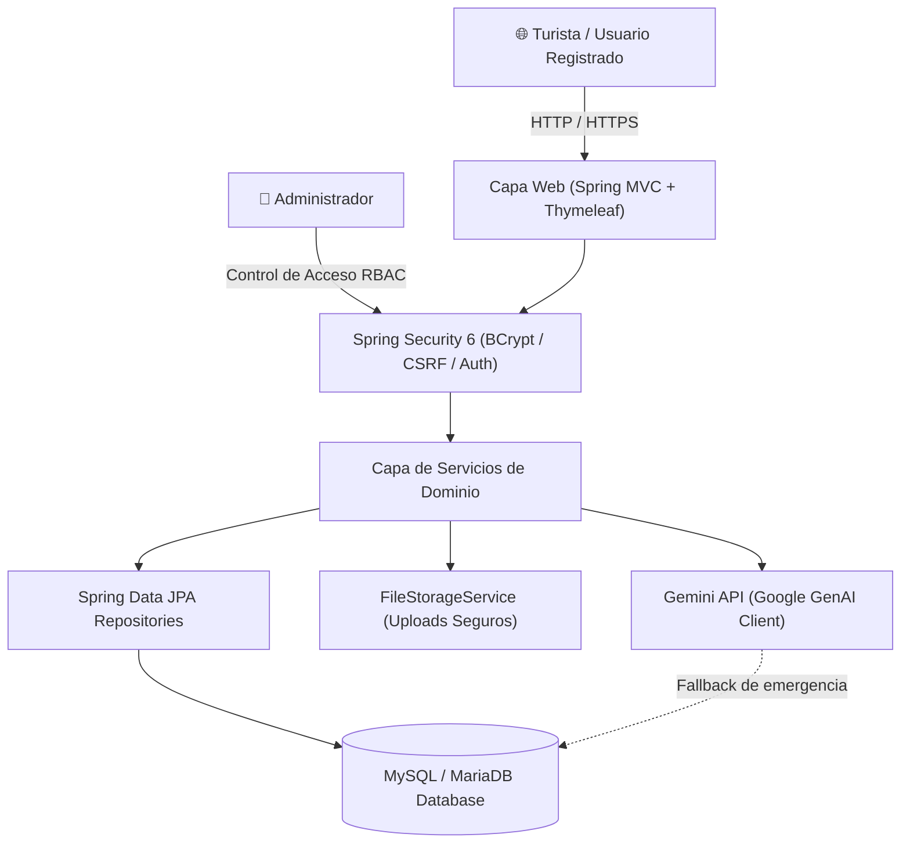

# ⛵ Odyssey — Guía Turística Inteligente & Asistente IA para Cartagena de Indias

<p align="center">
  
  
  
  
  
  
  
</p>

<p align="center">
  <strong>Odyssey</strong> es una plataforma web turística bilingüe y asistente con Inteligencia Artificial creada para revolucionar la forma en que los viajeros exploran y disfrutan de <strong>Cartagena de Indias, Colombia</strong> (Patrimonio Histórico y Cultural de la Humanidad por la UNESCO).
</p>

---

## 🌟 Características Principales

### 🤖 Asistente Virtual Inteligente (Odyssey AI)
- Impulsado por **Google Gemini 2.5 Flash** con prompts contextualizados en cultura, gastronomía, historia, transporte y playas de Cartagena.
- **Arquitectura Híbrida Resiliente:** Si no hay conexión o se excede la cuota de API, el sistema recurre automáticamente a un motor de búsqueda por palabras clave en base de datos local.
- **Detección Automática de Idioma:** Adapta sus respuestas de manera nativa en **Español** o **Inglés**.

### 🏛️ Catálogo y Guía Turística Completa
- Exploración de sitios históricos, playas paradisíacas, museos, hoteles y gastronomía caribeña.
- Búsqueda en tiempo real e indexada por categorías.
- Ficha detallada por lugar con ubicación, mapas interactivos, horarios y galería fotográfica.

### 📅 Agenda de Eventos y Actividades
- Cartelera de festivales emblemáticos (Hay Festival, FICCI, Fiestas de Independencia, Concurso Nacional de Belleza, Regatas).
- Actividades guiadas (buceo, snorkel, tour en chiva rumbera, kayak en manglares, pesca deportiva).

### ⭐ Comunidad y Reseñas de Visitantes
- Sistema interactivo de calificaciones de 1 a 5 estrellas y comentarios por lugar.
- Control de autoría: los usuarios solo pueden editar o eliminar sus propias opiniones.

### 🏪 Ecosistema para Emprendedores Locales & Moderación
- Los prestadores turísticos y usuarios registrados pueden proponer nuevos lugares, eventos y actividades.
- **Panel Administrativo (`/admin`)** con flujos de aprobación, rechazo y edición con un solo clic.

### 🌦️ Clima en Tiempo Real & Transporte
- Widget meteorológico en vivo (temperatura, humedad, viento y estado del cielo) con API de Open-Meteo.
- Guía detallada de movilidad (Transcaribe, taxis, lanchas a islas y traslados al Aeropuerto Rafael Núñez).

---

## 🏗️ Arquitectura Técnica



---

## 💻 Stack Tecnológico

| Capa | Tecnologías |
| :--- | :--- |
| **Backend** | Java 21 (LTS), Spring Boot 3.2.5, Spring Data JPA, Spring Security 6 |
| **Validación** | Hibernate Validator / Bean Validation (Jakarta Validation) |
| **Frontend** | HTML5, CSS3, Bootstrap 5, JavaScript Vanilla, Thymeleaf Template Engine |
| **Base de Datos** | MySQL 8.0+ / MariaDB 10.4+ |
| **Inteligencia Artificial** | Google Gemini 2.5 Flash REST API |
| **Almacenamiento** | FileStorageService desacoplado en disco local (`~/odyssey-uploads/`) |
| **Testing** | JUnit 5, Mockito, Spring Security Test |
| **Construcción** | Apache Maven 3.9+ |

---

## 🚀 Instalación y Configuración Local

### 1. Requisitos Previos
- **Java Development Kit (JDK) 21** o superior.
- **Apache Maven 3.9+**.
- **MySQL Server 8.0+** o MariaDB en ejecución (puerto 3306).
- *(Opcional)* API Key de [Google AI Studio](https://aistudio.google.com/app/apikey) para activar el chatbot con IA.

### 2. Clonar el Repositorio
```bash
git clone https://github.com/josezambranol/Odyssey.git
cd Odyssey
```

### 3. Configurar la Base de Datos
1. Inicia tu servidor MySQL.
2. Crea e importa la estructura de datos:
```sql
CREATE DATABASE IF NOT EXISTS odyssey_db CHARACTER SET utf8mb4 COLLATE utf8mb4_general_ci;
```
*(Puedes importar el archivo SQL incluido en `sql/odyxsvg_db.sql`)*.

### 4. Configurar Variables de Entorno
Copia el archivo de plantilla `.env.example` o configura las variables en tu entorno:

```properties
# Base de Datos
DB_URL=jdbc:mysql://localhost:3306/odyxsvg_db?useUnicode=true&characterEncoding=UTF-8&serverTimezone=UTC
DB_USERNAME=root
DB_PASSWORD=tu_contraseña

# Puerto del Servidor
PORT=8080

# Google Gemini API Key (Opcional - si no se provee, usará el fallback de BD)
GEMINI_API_KEY=tu_api_key_aqui
```

### 5. Compilar y Ejecutar
```bash
# Ejecutar pruebas unitarias
mvn test

# Iniciar la aplicación
mvn spring-boot:run
```

Abre tu navegador en: [**http://localhost:8080**](http://localhost:8080)

---

## 🔐 Credenciales Iniciales por Defecto

Al iniciar por primera vez, el sistema inicializa automáticamente la cuenta administrativa:

- **Panel Admin:** `http://localhost:8080/admin`
- **Correo:** `admin@odyssey.com`
- **Contraseña:** `admin2026` *(se almacena con cifrado BCrypt)*

---

## 🧪 Pruebas Automatizadas

El proyecto cuenta con una suite de pruebas unitarias cubriendo servicios de autenticación, almacenamiento seguro de archivos y lógica de reseñas:

```bash
mvn test
```

---

## 📖 Documentación Adicional

Para más detalles técnicos, consulta la carpeta [`/docs`](./docs):
- [**01. Contexto e Historias de Usuario (RF001 - RF011)**](./docs/01_CONTEXTO_Y_HISTORIAS_DE_USUARIO.md)
- [**02. Arquitectura y Modelo de Datos (DER)**](./docs/02_ARQUITECTURA_Y_MODELO_DE_DATOS.md)
- [**03. Diagnóstico de Seguridad y Deuda Técnica**](./docs/03_SEGURIDAD_Y_DEUDA_TECNICA.md)
- [**04. Hoja de Ruta y Plan de Modernización**](./docs/04_HOJA_DE_RUTA_Y_PLAN_DE_REFACCION.md)

---

## 👨‍💻 Autor y Reconocimientos

Desarrollado y mantenido por **Jose Daniel Zambrano Luna**.
- **GitHub:** [@josezambranol](https://github.com/josezambranol)
- **Origen del Proyecto:** Trabajo de grado y evolución académica en el programa de *Tecnología en Desarrollo de Software (TDS)*.