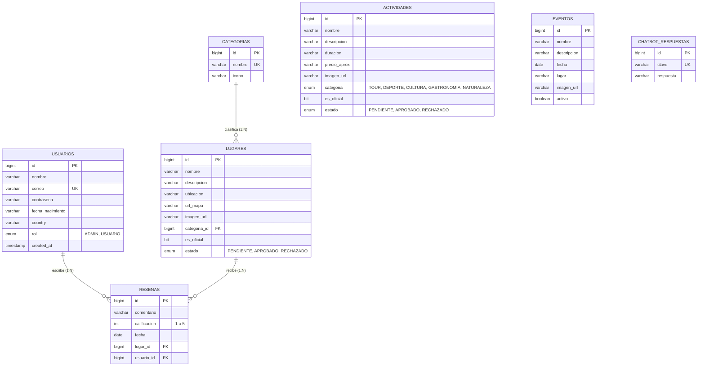

# 🏛️ ODYXS — Arquitectura y Modelo de Datos

## 1. Arquitectura en Capas (Layered Architecture)

La aplicación sigue el patrón MVC (Model-View-Controller) respaldado por Spring Boot:

```
[ Cliente Web / Navegador ]
            │
            ▼ (HTTP / HTTPS / REST)
┌────────────────────────────────────────────────────────┐
│                   Capa de Controladores               │
│  - IndexController          - LugarController         │
│  - ActividadController      - Evento/TurismoController│
│  - UsuarioController        - AdminController         │
│  - ResenaController         - IdiomaController        │
└───────────────────────────┬────────────────────────────┘
                            │ (DTOs / ViewModels)
┌───────────────────────────▼────────────────────────────┐
│                    Capa de Servicios                   │
│  - UsuarioService           - LugarService            │
│  - ActividadService         - ResenaService           │
│  - CategoriaService         - FileStorageService      │
│  - GeminiChatbotService                                │
└───────────────────────────┬────────────────────────────┘
                            │ (Entities / Models)
┌───────────────────────────▼────────────────────────────┐
│                  Capa de Repositorios                  │
│  - UsuarioRepository        - LugarRepository         │
│  - ActividadRepository      - EventoRepository        │
│  - ResenaRepository         - ChatbotRespuestaRepo    │
└───────────────────────────┬────────────────────────────┘
                            │ (Spring Data JPA / Hibernate)
┌───────────────────────────▼────────────────────────────┐
│            Base de Datos MySQL (odyxsvg_db)            │
└────────────────────────────────────────────────────────┘
```

---

## 2. Modelo de Entidades y Relaciones (DER)



---

## 3. Diccionario de Datos

### 3.1. `usuarios`
Almacena las credenciales y perfiles de los usuarios y administradores.
- `id` (BIGINT, PK, Auto-increment): Identificador único.
- `nombre` (VARCHAR(255), Not Null): Nombre completo del usuario.
- `correo` (VARCHAR(255), Not Null, Unique): Correo de acceso.
- `contrasena` (VARCHAR(255), Not Null): Hash BCrypt de la clave.
- `rol` (ENUM('ADMIN', 'USUARIO'), Not Null): Rol de autorización.
- `fecha_nacimiento` (VARCHAR(255)): Fecha de nacimiento opcional.
- `country` (VARCHAR(255)): País de origen del visitante.

### 3.2. `lugares`
Puntos de interés turístico en Cartagena de Indias.
- `id` (BIGINT, PK, Auto-increment).
- `nombre` (VARCHAR(255), Not Null).
- `descripcion` (VARCHAR(1000)).
- `ubicacion` (VARCHAR(255), Not Null).
- `url_mapa` (VARCHAR(1000)): Enlace a Google Maps / Street View.
- `imagen_url` (VARCHAR(500)): Ruta o URL a la imagen representativa.
- `categoria_id` (BIGINT, FK -> categorias.id, Not Null).
- `es_oficial` (BIT(1)): `1` si fue creado por el staff ODYXS, `0` si fue propuesto por la comunidad.
- `estado` (ENUM('PENDIENTE', 'APROBADO', 'RECHAZADO')).

### 3.3. `actividades`
Tours, deportes acuáticos, rutas gastronómicas y culturales.
- `id` (BIGINT, PK, Auto-increment).
- `nombre` (VARCHAR(255), Not Null).
- `descripcion` (VARCHAR(1000)).
- `duracion` (VARCHAR(255)): Ej. "2 horas", "Medio día".
- `precio_aprox` (VARCHAR(255)): Ej. "$50.000 COP".
- `imagen_url` (VARCHAR(500)).
- `categoria` (ENUM('TOUR', 'DEPORTE', 'CULTURA', 'GASTRONOMIA', 'NATURALEZA')).
- `es_oficial` (BIT(1)).
- `estado` (ENUM('PENDIENTE', 'APROBADO', 'RECHAZADO')).

### 3.4. `eventos`
Festivales, regatas, fiestas patronales y eventos anuales en Cartagena.
- `id` (BIGINT, PK, Auto-increment).
- `nombre` (VARCHAR(255), Not Null).
- `descripcion` (VARCHAR(1000)).
- `fecha` (DATE, Not Null).
- `lugar` (VARCHAR(255)).
- `imagen_url` (VARCHAR(500)).
- `activo` (TINYINT(1)/BOOLEAN, Not Null): `1` para aprobados / activos.

### 3.5. `resenas`
Calificaciones y retroalimentación de visitantes sobre lugares turísticos.
- `id` (BIGINT, PK, Auto-increment).
- `comentario` (VARCHAR(500)).
- `calificacion` (INT, Not Null): Valor entero entre 1 y 5.
- `fecha` (DATE, Not Null).
- `lugar_id` (BIGINT, FK -> lugares.id).
- `usuario_id` (BIGINT, FK -> usuarios.id).

### 3.6. `chatbot_respuestas`
Banco de respuestas predefinidas para el fallback sin conexión del chatbot ODYX.
- `id` (BIGINT, PK, Auto-increment).
- `clave` (VARCHAR(100), Not Null, Unique): Clave temática (ej: `playas`, `clima`, `transporte`, `gastronomia`, `hoteles`).
- `respuesta` (VARCHAR(2000), Not Null): Texto de respuesta detallada.